# Straightforward-instrcutions-on-cadence-virtuoso-under-VMware-Workstation
This project gives out a very simple instruction on how to use cadence virtuoso for circuit design and layout drawing

## My lab
There is a [lab](lab/readme.md) equipped with many simple experiments.

## Project buiding phase
First, we need to make a folder on our desktop, and enter Virtuoso, using the command as follow:
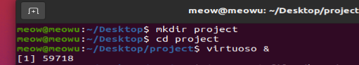

Then, choose "File->New->Library" to create a new library. Take "inv" as example, we input the library name and chooose "Attach to an existing technology library", and we choose "smic18mmrf" as example.
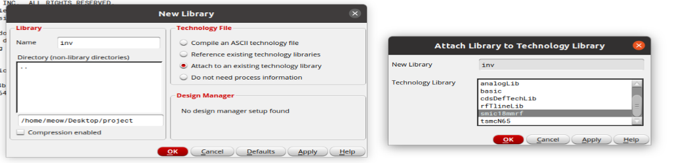

## Schematic phase
We now create a schematic for "inv", and finish the schematic drawing.
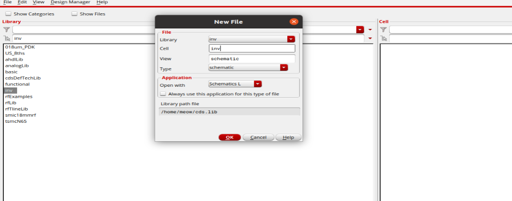
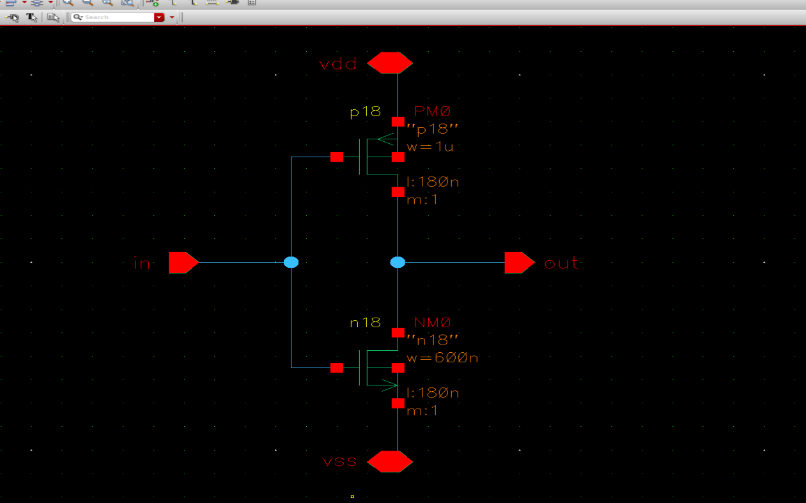

We use "Check->Current Cellview" to check if there is a connection error in our schematic.

## Symbol phase
If there is no errors in our schematic, using "Create->Cellview->From Cellview..." to create a symbol.
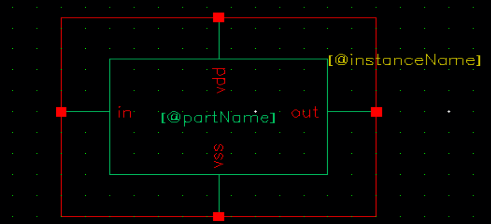

## CDL and netlist generation phase
Go back to the Virtuoso page, using "File->Export->CDL..." to generate CDL. Choosing inv_schematic and replacing "Output CDL Netlist File" as inv.cdl
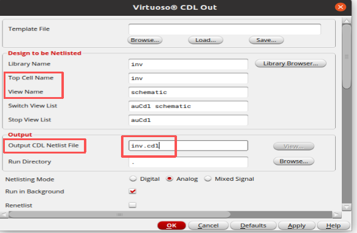

If the analysis job succeeded, we will go to the next phase.
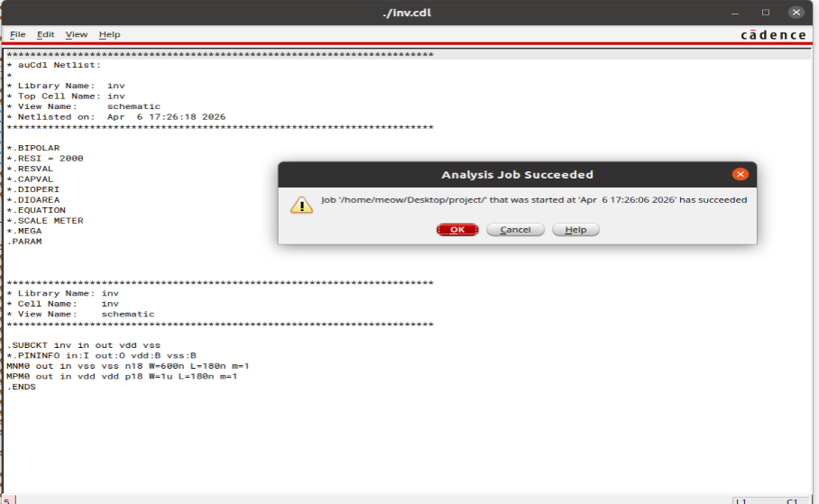

## Layout phase
We first move into the schematic, choose "Launch->Layout XL" to create a layout. 

When we get into the layout, use "Connectivity->Generate->All from source..." to upload. Use "Shift+F" to convert layout format.
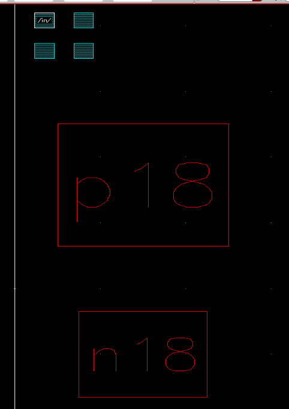
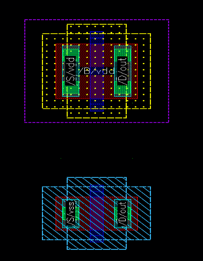

Complete the connections in layout.

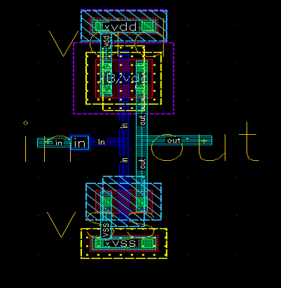

## DRC check phase
We use DRC to check. The layout is qualified if only "density" errors occur as follow:
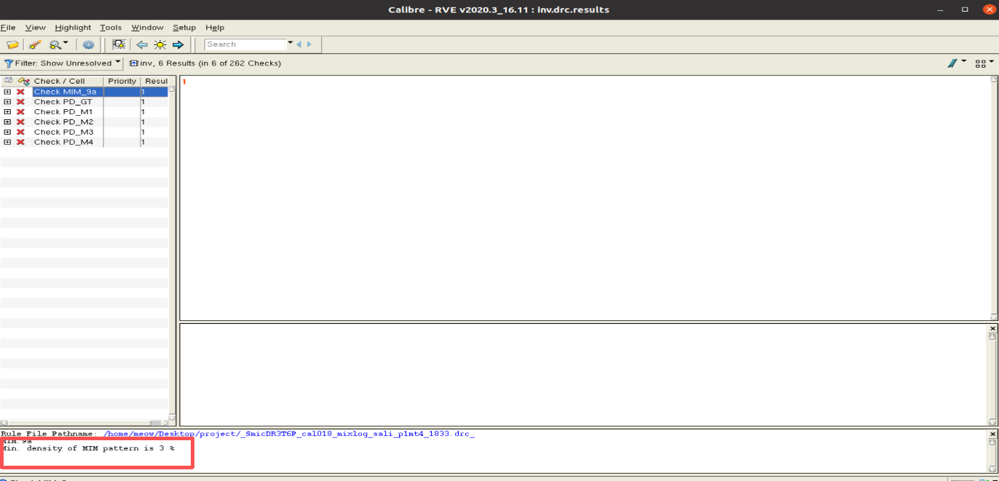

## LVS check phase
We use LVS to check. The layout is qualified if the laughing face appears.
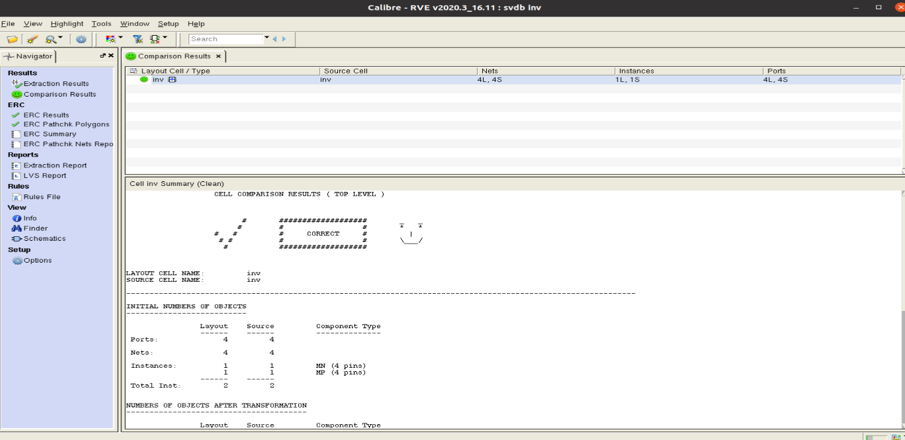

